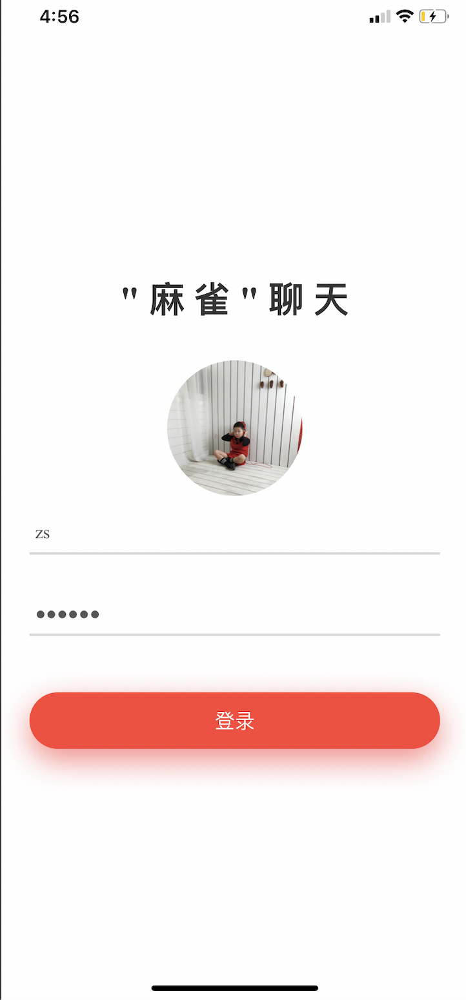
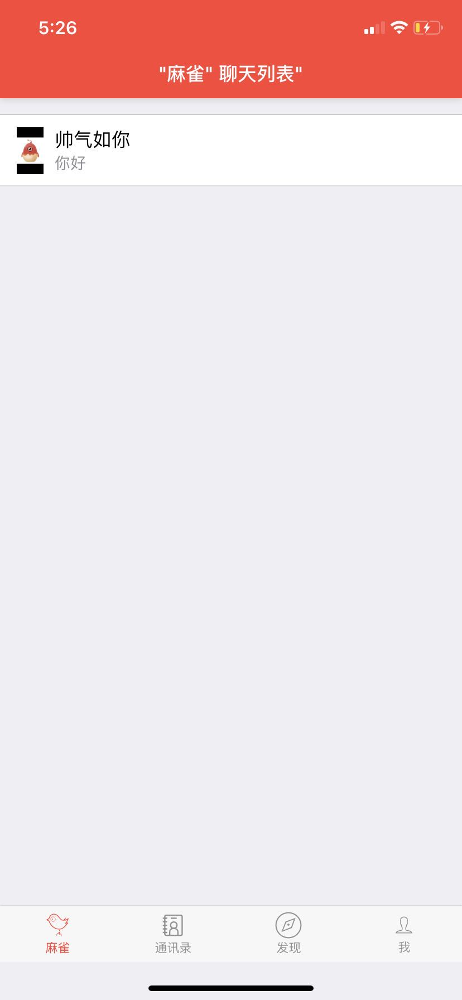
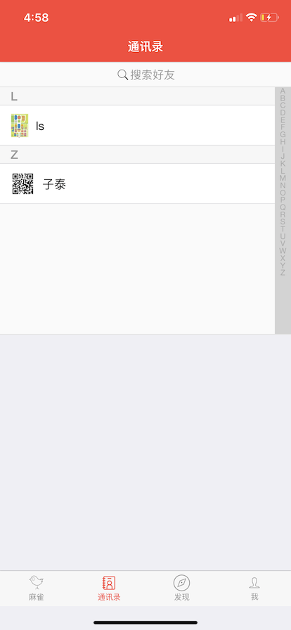
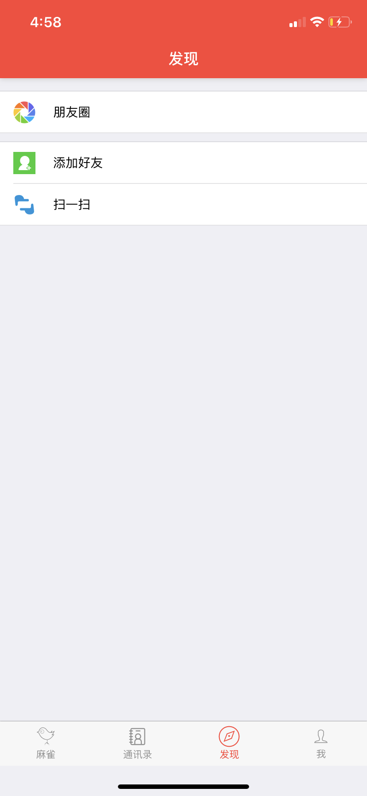
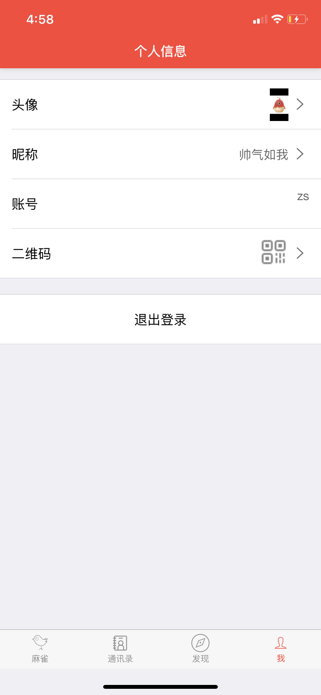
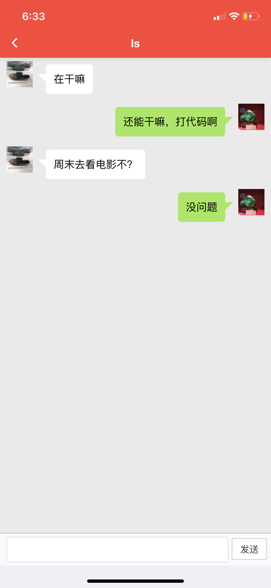

### 聊天应用后端模块由``用户模块``和``聊天模块``。

* 在用户模块，特别的使用了在服务器搭建了FastDFS服务器（分布式文件系统），用于存储用户头像。有关详细的FastDFS的搭建👉[博客](https://blog.csdn.net/zyx1260168395/article/details/103910291?utm_medium=distribute.pc_relevant.none-task-blog-baidujs-9)

* 聊天模块，使用Netty框架+WebSocket协议来实现，使用Netty框架避免使用原生io框架写出繁杂的代码，而WebSocket协议则是服务器与客户端保持长连接。

  

### Mysql文件：

```mysql
SET NAMES utf8mb4;
SET FOREIGN_KEY_CHECKS = 0;

-- ----------------------------
-- Table structure for chat_msg
-- ----------------------------
DROP TABLE IF EXISTS `chat_msg`;
CREATE TABLE `chat_msg` (
  `id` varchar(64) NOT NULL,
  `send_user_id` varchar(64) NOT NULL,
  `accept_user_id` varchar(64) NOT NULL,
  `msg` varchar(255) NOT NULL,
  `sign_flag` int(1) NOT NULL COMMENT '消息是否签收状态\r\n1：签收\r\n0：未签收\r\n',
  `create_time` datetime NOT NULL COMMENT '发送请求的事件',
  PRIMARY KEY (`id`)
) ENGINE=InnoDB DEFAULT CHARSET=utf8mb4;

-- ----------------------------
-- Table structure for friends_request
-- ----------------------------
DROP TABLE IF EXISTS `friends_request`;
CREATE TABLE `friends_request` (
  `id` varchar(64) NOT NULL,
  `send_user_id` varchar(64) NOT NULL,
  `accept_user_id` varchar(64) NOT NULL,
  `request_date_time` datetime NOT NULL COMMENT '发送请求的事件',
  PRIMARY KEY (`id`)
) ENGINE=InnoDB DEFAULT CHARSET=utf8mb4;

-- ----------------------------
-- Table structure for my_friends
-- ----------------------------
DROP TABLE IF EXISTS `my_friends`;
CREATE TABLE `my_friends` (
  `id` varchar(64) NOT NULL,
  `my_user_id` varchar(64) NOT NULL COMMENT '用户id',
  `my_friend_user_id` varchar(64) NOT NULL COMMENT '用户的好友id',
  PRIMARY KEY (`id`),
  UNIQUE KEY `my_user_id` (`my_user_id`,`my_friend_user_id`)
) ENGINE=InnoDB DEFAULT CHARSET=utf8mb4;

-- ----------------------------
-- Table structure for users
-- ----------------------------
DROP TABLE IF EXISTS `users`;
CREATE TABLE `users` (
  `id` varchar(64) NOT NULL,
  `username` varchar(20) NOT NULL COMMENT '用户名，账号，慕信号',
  `password` varchar(64) NOT NULL COMMENT '密码',
  `face_image` varchar(255) NOT NULL COMMENT '我的头像，如果没有默认给一张',
  `face_image_big` varchar(255) NOT NULL,
  `nickname` varchar(20) CHARACTER SET utf8mb4 COLLATE utf8mb4_unicode_ci NOT NULL COMMENT '昵称',
  `qrcode` varchar(255) NOT NULL COMMENT '新用户注册后默认后台生成二维码，并且上传到fastdfs',
  `cid` varchar(64) DEFAULT NULL,
  PRIMARY KEY (`id`),
  UNIQUE KEY `id` (`id`),
  UNIQUE KEY `username` (`username`)
) ENGINE=InnoDB DEFAULT CHARSET=utf8mb4;

SET FOREIGN_KEY_CHECKS = 1;

```


### 项目展示：












